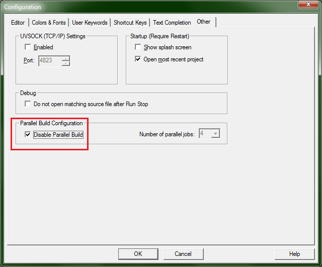
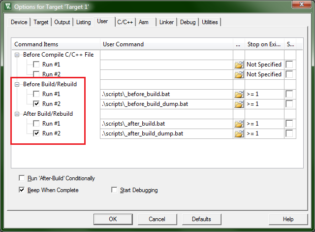
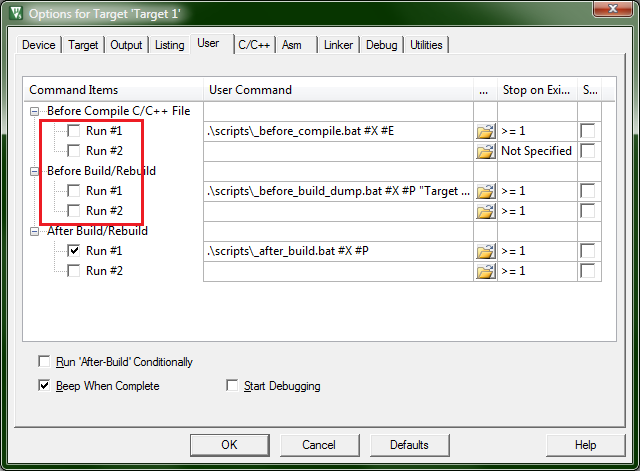

## This repo contains two examples for PVS-Integration in Keil uVision IDE.

They both relies on availability of some kind of `bash` in Windows (i.e. MSYS or WSL).
`semi_manual` requires a bit more handiwork; `cl_monitor_dump_filter` is more handy but relies on external tool.

## Common steps before using both examples:

1. Add bash.exe to `Path` or create env. variable `GIT_BASH_PATH` and add path to bash.exe there (with a slash at the end, i.e. `C:\Program Files\Git\bin\`)
2. Add CLMonitor.exe to `Path` or, once again, create env. variable `PVS_STUDIO_PATH`

## Steps for `semi_manual`

- When you build project for the very first time you will get an error:

```
PVS Studio dump file not found! Please, create it first!
```

- Every time you modify Project tree (like, add or remove files) you will see a warning message:

```
-------------------
PVS Studio warning:
-------------------
Project file was changed! Some files were added or removed:
```

- Every time you change Target (sadly, no diagnostic will be issued)

In all of these cases you need to generate new compilation dump. To do this you should:
1. In Keil go to Edit->Configuration->Other and check `Disable Parallel build`
   


2. Go to Project->Options for target->User; uncheck 'normal' scripts and check scripts with `_dump`:



3. Do a full rebuild. If everything goes well, you should see a message:

```
PVS Studio dump saved successfully!
```

4. Reverse actions 1 and 2: enable Parallel build and check `normal scripts` (without `_dump`)

5. Enjoy PVS-Studio analysis in Keil Build Output window!

## Steps for `cl_monitor_dump_filter`

1. Do a full rebuild, ignore flying terminal windows. When Keil asks to reload project - do not agree! If you agree, you will loose all the build output!
   
2. Inspect Build Output window. It should contain analysis results right away!

However, you will find that output is littered with lines like `Before Translate - User command #1: .\scripts\_before_compile.bat E:\Keil_5.30\UV4\UV4.exe keil_pvs_example\cl_monitor_dump_filter\tests\src\Main\main.cpp`.

- If you grow tired of those (and constant alerts asking to reload a project file), you can go to Project->Options for target->User and uncheck `Before Compile` and `Before Build/Rebuild`.



Then build will be "clean". However, once again, if you will modify project tree or change build target, you will have to enable those scripts again.

Also, every build target should pass its name to `Before Build/Rebuild` script like this:

`.\scripts\_before_build_dump.bat #X #P "Target 1"` where `"Target 1"` is quoted target name.

If you fail to do this (or create a new dump for modified project tree) you will see incorrect (old) analysis results!


